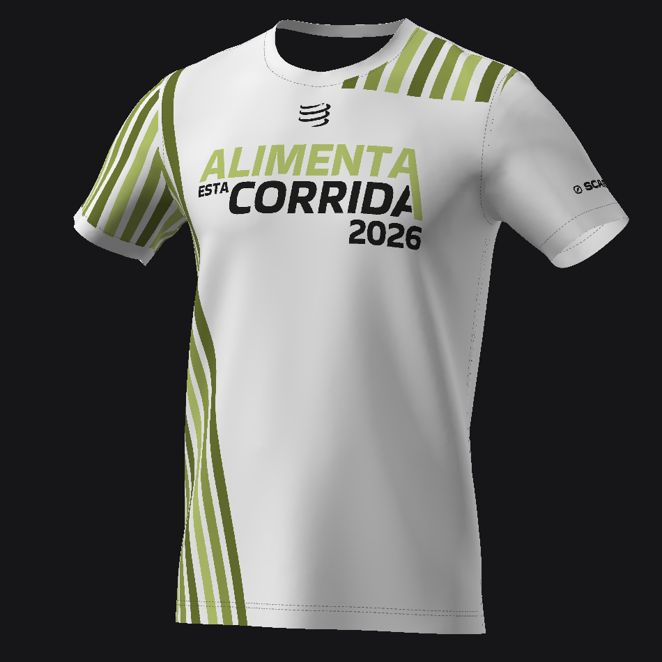

# Alimenta Esta Corrida 2026 — 3D t-shirt

An interactive Babylon.js preview of the event t-shirt: the official print
applied to a real garment model, with topstitching, knit fabric and studio
lighting.



## Run it

```bash
bun run dev     # http://localhost:3000
```

No build step. Babylon loads from its CDN; the page and its assets are served
straight from disk.

There is also `src/playground.js` — the same scene shaped for
[playground.babylonjs.com](https://playground.babylonjs.com). Select all, paste,
run. It fetches assets over HTTP from this repo's `main` branch, so they have to
be pushed before it will render.

## What makes this work

The model's UVs are the garment's **real 2D sewing pattern, in millimetres**. So
a point at (120 mm, 215 mm) in the front texture lands on exactly that spot of
the physical panel, and the UV island boundary *is* the neckline, armhole,
shoulder and hem.

Everything follows from that. The print is composed in pattern millimetres and
terminates exactly on the seams. The topstitching is derived from the mesh's own
boundary rather than drawn. The knit weave tiles every 15 mm of actual fabric.
None of it needs hand-tuned fudge factors, because none of it is a projection.

## Layout

```
src/       the Babylon scene — page, Playground twin, dev server
assets/    everything fetched at runtime: model, textures, environment
tools/     the offline pipeline (Python, numpy + Pillow only)
pipeline-design/   the pipeline's design inputs and intermediates:
                   artwork, pattern data, PSD exports, preview renders
docs/      how and why
```

`assets/` sits at the root rather than under `src/` on purpose: it is published
content, fetched over HTTP by the Playground, so its path is part of a public URL.

## Docs

| | |
|---|---|
| [pipeline.md](docs/pipeline.md) | how a model plus artwork becomes what you see, stage by stage |
| [decisions.md](docs/decisions.md) | why it is built this way — including what was got wrong first |
| [tools.md](docs/tools.md) | each tool: the need it answers and how to run it |
| [reusable-pipeline.md](docs/reusable-pipeline.md) | generalising to many layouts, many garments, a store |
| [artwork-brief-pt.md](docs/artwork-brief-pt.md) | the artwork requirements, written to send to a designer (PT) |

New here? Read `decisions.md` §1 first — it is the idea the rest depends on.
Commissioning artwork for a new event? Send `artwork-brief-pt.md`; the reasoning
behind it is `reusable-pipeline.md` §2.

## Regenerating

```bash
python3 tools/build_print_textures.py   # the usual one, after a design change
python3 tools/extract_pattern.py        # after a model change
python3 tools/pdf_to_svg.py             # after an artwork change
```

Then check it:

```bash
python3 tools/preview_render.py --textures print --view reference
python3 tools/check_scene_sync.py
```

`preview_render.py` is a fast loop, not a verdict — it is a Lambert rasteriser
and cannot judge sheen, IBL or tone mapping. **Confirm in a browser.**

`check_scene_sync.py` guards the invariant that the page and the Playground copy
run the same scene. Run it after touching either.

## Credits

Design and event by [Associação Hélio Fumo](https://www.associacaoheliofumo.pt) —
*Inclusão Social Pelo Desporto*. Studio environment map from Babylon.js
(MIT, © Microsoft) — see [assets/env/README.md](assets/env/README.md).
